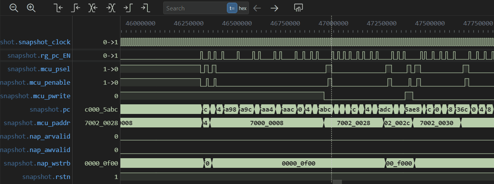

# VaporView

VaporView is a VCD waveform viewer extension for Visual Studio Code designed for FPGA/RTL developers.

## Controls

### Keyboard Shortcuts

- **Ctrl + Scroll Wheel** - Zoom in and out on waveforms
- **Shift + Scroll Wheel** - Scroll up and down on waveforms
- **Up/Down Arrow** - Select signal above/below selected signal
- **Alt + Up/Down Arrow** - Rearrange selected signal
- **Ctrl + Left/Right Arrow** - Move marker to previous/next value transition of selected signal
- **Alt + Click or Middle Click** - Set Alt marker

### Adding and Removing Signals

Signals may be added or removed through VaporView view container. Click on the VaporView Activity Bar icon, and it will show the netlist for the opened waveform file as well as the signals displayed in the tab.

To Add a signal, simply check the box next to the netlist signal ID in the "Netlist" view. It will also show in the "Displayed Signals" view.

To remove a signal, that signal can be un-checked from either the "Netlist" view or the "Displayed Signals" view.

### Scrolling

The scroll wheel (or touchpad scroll) is used to pan in time or scroll up or down. By default, mouse mode scrolling is enabled. To toggle between scrolling modes, click the "Enable Touchpad Scrolling" Button on the top right

#### Mouse Scrolling

Scrolling behaves as you would expect except for when scrolling the actual waveforms (where it scrolls sideways by default.) To scroll up or down, either hold Shift and scroll, or move your marker over to the signal name labels on the left and scroll normally.

#### Touchpad Scrolling

### Zooming

To Zoom in or out, hold Ctrl, and Scroll to zoom. Or use the Zoom in/out buttons on the top right.

### Rearranging signals

To rearrange signals, hover over the signal name, and you will see a rearrange grabber indicator on the left. Click and drag to rearrange.

Alternatively, you can select a signal, hold Alt, and press on the Up or Down Arrows to reorder (similar to how you reorder lines in the text editor)

### Marker Handling

There are two markers in vaporview: a normal marker, and an alt marker. To place the marker, simply click where you want it to be placed. Keep in mind that it will snap to edge if applicable. To place the alt marker, either middle click, or Alt + click where you would like to place it. The Alt marker will also snap to an edge if applicable.

It should also be noted that signals can be selected by clicking on them, You can also use the Up/Down Arrow keys to move the selection.

#### Next/Previous Edge

To move the marker to the nearest edge _**of the selected signal**_, you can either click the control bar buttons, or use Ctrl + Left/Right Arrow (similar to how in the text editor, you can move the marker to a word boundary)

To move to the next positive edge or negative edge, you will have to use the control bar buttons. This only applies to single bit waveforms.

#### Finding values and transitions in a particular waveform

Finding a particular transition or a value in a waveform is done in relation to the selected signal and the marker (similar to how Visual Studio Code handles search in relation to the marker)

## Requirements

This extension was designed on version 1.83.

## Release Notes and development roadmap

### 0.9.5 (Current Pre-release)

Supports all the features you would expect including signal placing, rearranging, marker handling, and exporting selection to WaveDrom!

### 1.0 - Marketplace launch

Get more coverage, from users like you! There will probably be bugs, so please report them on the github discussions!

Additional features and bugfixes to known Issues:

- Features:
  - Saving/loading opened signals
- Bugfixes
  - binary waveforms sometimes display a gap between chunks
  - When opening another vcd file, the netlist needs to load in the view properly
- Other:
  - Refine documentation

### Beyond 1.0

- Rewrite compute intensive components in Web Assembly for smoother performance
- Add support for Enums
- Add support to highlight all transitions of a signal
- Add support for custom colors
- Add support for linking timestamps in UVM logs (or other simulation logs) to jump to a timestamp
- Add support for remote sessions to save on memory
- Add support for larger files
- Highly unlikely
  - Link netlist to RTL so that signals can be connected back to RTL locations
  - Support for other file formats

## About This Extension

I originally built this because I work for an FPGA company, doing FPGA things, and I couldn't find a good _free_ VCD viewer extension. I also hate having to use VNC for viewing waveforms. So rather than spend $15, I spent 300 hours making this extension.

This is and always will be open source. It's free to use for personal and professional use. There never will be feature regression in favor of a premium tier. In other words, every feature that is currently included, or on the roadmap will be free and open source. Adaptations of the source code completely or even in part for other projects _is_ only allowed _if_ the project is also free and open source. Adaptations of the source code completely or in part for enterprise software is not allowed _unless_ prior written permission is given by the owner of this project. And I am open to offers.

This extension was written by one person, with a full time job that doesn't involve anything to do with writing javascript or typescript. If you would like to see a feature added or functionality changed, or better yet, if you would like to help contribute please visit the github repository and discuss there!

## Acknowledgements

This extension uses a modified version of [clusterize.js](https://clusterize.js.org/)